# NovelAgent — Phase 3 Agent 运行流程详细图

> 生成日期: 2026-06-10  
> 覆盖范围: 从程序启动 → REPL 交互 → Agent 消息处理 → 上下文组装 → Tool Call 循环 → 工具执行 → LLM 流式调用 → 结果返回的完整链路  
> 图表格式: Mermaid（可在 VS Code、GitHub、Typora 中直接渲染）

---

## 一、系统启动总览

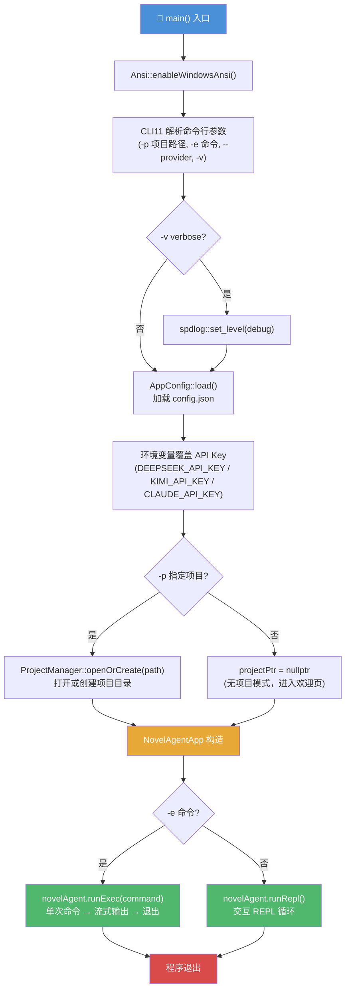

---

## 二、NovelAgentApp 构造与装配

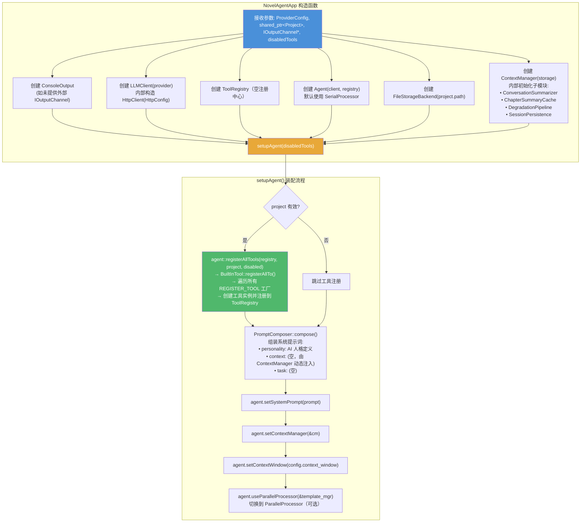

---

## 三、REPL 交互主循环（ReplHandler::run）

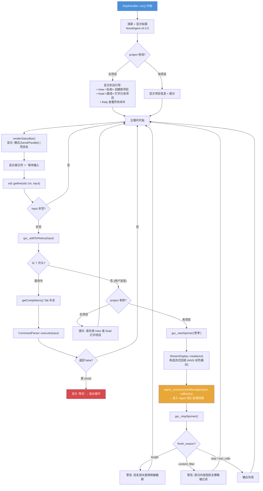

---

## 四、Agent 消息处理核心流程（SerialProcessor::process）

这是 Phase 3 的**核心链路**，展示了从用户消息到 LLM 响应的完整数据流。

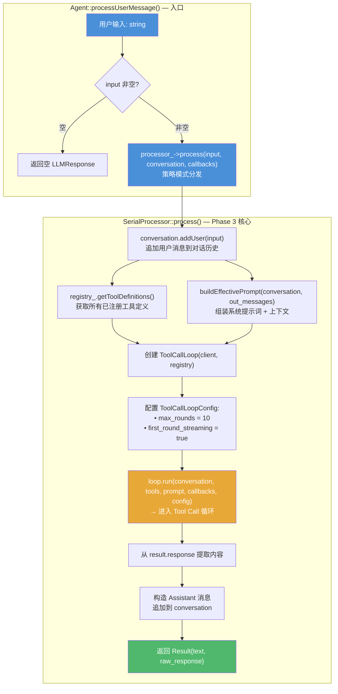

---

## 五、上下文组装流程（ContextManager::assemble）

```mermaid
flowchart TD
    A["ContextManager::assemble(conversation, context_window, project, chapter_id)"] --> B["1. 预算分配 allocateBudget()"]

    subgraph "预算分配 (80/20 + 50/30/20 规则)"
        B --> B1["total_budget = context_window × 0.8"]
        B1 --> B2["chapter_budget = total × 50%\nconversation_budget = total × 30%\nsummary_budget = total × 20%"]
    end

    B2 --> C["2. 构建系统提示词 buildSystemPrompt()"]

    subgraph "系统提示词构建"
        C --> C1{"chapter_id 为空?"}
        C1 -->|"是"| C2["基础提示词:\n# 项目: title\nLogline + 主题"]
        C1 -->|"否"| C3["PromptContextBuilder::buildForChapter()\n构建章节上下文:\n• 当前章节信息\n• 前后章节摘要\n• 相关角色/设定\n• 大纲进度"]
    end

    C2 & C3 --> D["3. Token 开销计算"]
    D --> D1["sys_tokens = TokenCounter::countTokens(system_prompt)"]
    D1 --> D2["msg_budget = max(0, total_budget - sys_tokens)"]
    D2 --> D3["raw_msg_tokens = TokenCounter::countMessages(all_msgs)"]

    D3 --> E{"需降级?\nraw_msg_tokens > msg_budget\n或 sys_tokens > chapter_budget"}
    E -->|"是"| F["4. 触发降级策略 DegradationPipeline"]

    subgraph "降级策略 (四级)"
        F --> F1["L1: 压缩角色描述\n(保留名称+核心特征)"]
        F1 --> F2["L2: 删除次要角色\n(仅保留主角+关键配角)"]
        F2 --> F3["L3: 只保留章节 ID 列表\n(删除详细元数据)"]
        F3 --> F4["L4: 移除章节上下文\n(仅保留项目标题)"]
    end

    F4 --> G["重新计算 token → 更新 sys_tokens / msg_budget"]
    E -->|"否"| H["5. 对话摘要判断"]
    G --> H

    subgraph "对话摘要"
        H --> H1{"raw_msg_tokens > msg_budget\n且 消息数 > 10?"}
        H1 -->|"是"| H2["ConversationSummarizer::summarize()\n提取关键信息:\n• 当前任务\n• 关键决策\n• 重要发现\n• 待办事项"]
        H2 --> H3["render 为文本\n扣除 summary tokens 预算"]
        H1 -->|"否"| H4["跳过摘要"]
    end

    H3 & H4 --> I["6. 消息截断 truncateMessages()"]

    subgraph "消息截断 (O(n) 反向遍历)"
        I --> I1["从最新消息开始反向累加 token"]
        I1 --> I2{"累计 token <= budget?"}
        I2 -->|"是"| I3["保留该消息，继续"]
        I2 -->|"否"| I4["停止，丢弃更旧的消息"]
        I3 --> I1
        I4 --> I5["reverse → 恢复时间顺序"]
    end

    I5 --> J["7. 注入摘要"]
    J --> J1{"有摘要文本?"}
    J1 -->|"是"| J2["在消息列表头部插入:\n[上下文摘要 — 之前对话的关键信息]"]
    J1 -->|"否"| K["返回 ContextAssembly"]

    style A fill:#4a90d9,color:#fff
    style F fill:#e8a838,color:#fff
    style K fill:#50b86c,color:#fff
```

---

## 六、Tool Call 循环引擎（ToolCallLoop::run）

这是 Agent 与 LLM 交互的**核心循环**，负责首轮调用→检查工具调用→执行→回传→循环。

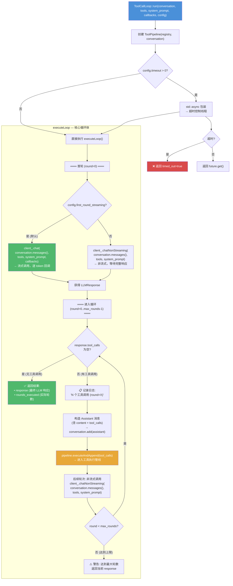

---

## 七、工具执行管线（ToolPipeline::executeAndAppend）

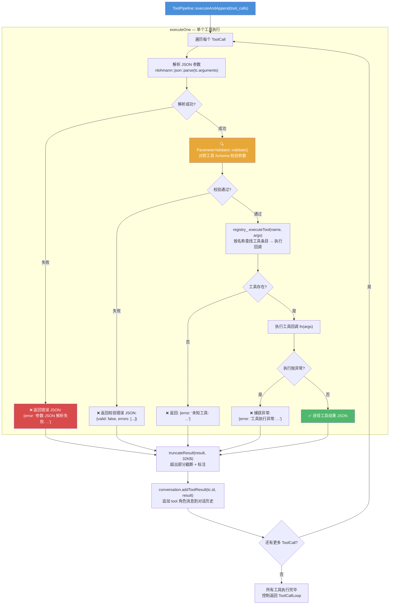

---

## 八、LLM 流式调用详细流程（LLMClient::chat）

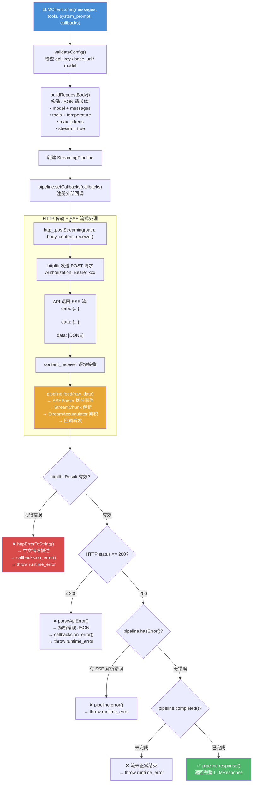

---

## 九、StreamingPipeline 内部数据流

SSE 文本 → StreamChunk → LLMResponse 的完整转换管线。

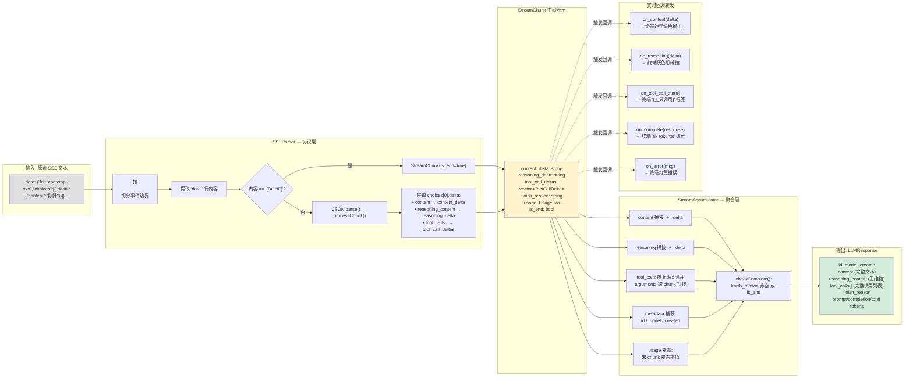

---

## 十、完整时序图：从用户输入到 LLM 响应

```mermaid
sequenceDiagram
    autonumber

    participant User as 👤 用户
    participant CLI as 🖥️ ReplHandler
    participant Agent as 🤖 Agent
    participant Proc as 🔀 SerialProcessor
    participant CM as 📊 ContextManager
    participant Loop as 🔄 ToolCallLoop
    participant Pipe as 🔧 ToolPipeline
    participant Reg as 📋 ToolRegistry
    participant Client as 🌐 LLMClient
    participant SP as 📡 StreamingPipeline
    participant Conv as 💬 Conversation

    %% ═══ 阶段 1: 用户输入 ═══
    rect rgb(240, 248, 255)
        Note over User,Conv: ═══ 阶段 1: 用户输入 ═══
        User->>CLI: 输入 "帮我写第三章"
        CLI->>CLI: startSpinner("思考")
        CLI->>CLI: StreamDisplay::create(out)
        CLI->>Agent: processUserMessage(input, callbacks)
        Agent->>Proc: process(input, conversation, callbacks)
    end

    %% ═══ 阶段 2: 上下文组装 ═══
    rect rgb(255, 250, 240)
        Note over Proc,CM: ═══ 阶段 2: 上下文组装 ═══
        Proc->>Conv: addUser("帮我写第三章")
        Proc->>Reg: getToolDefinitions()
        Reg-->>Proc: tools[]
        Proc->>CM: assemble(conversation, context_window, project, chapter_id)
        CM->>CM: 预算分配 (50/30/20)
        CM->>CM: 构建系统提示词 (项目+章节上下文)
        CM->>CM: Token 计算 + 降级判断
        CM->>CM: 对话摘要 (可选)
        CM->>CM: 消息截断 (O(n) 反向遍历)
        CM-->>Proc: ContextAssembly {system_prompt, messages, budget}
        Proc->>Proc: PromptComposer::compose({personality, context})
    end

    %% ═══ 阶段 3: Tool Call 循环 ═══
    rect rgb(240, 255, 240)
        Note over Proc,Client: ═══ 阶段 3: Tool Call 循环 — 首轮流式调用 ═══
        Proc->>Loop: 创建 ToolCallLoop(client, registry)
        Proc->>Loop: run(conversation, tools, prompt, callbacks, config)
        Loop->>Client: chat(messages, tools, system_prompt, callbacks)
        Client->>Client: validateConfig() + buildRequestBody()
        Client->>SP: 创建 StreamingPipeline + setCallbacks(callbacks)
        Client->>Client: http_.postStreaming()

        loop SSE 流式数据
            Client->>SP: feed(raw_sse_data)
            SP->>SP: SSEParser → StreamChunk
            SP->>SP: StreamAccumulator 累积
            SP-->>CLI: on_content(delta) → 终端绿色输出
            SP-->>CLI: on_reasoning(delta) → 终端灰色输出
        end

        SP-->>Client: completed → pipeline.response()
        Client-->>Loop: LLMResponse{content, tool_calls[]}
    end

    %% ═══ 阶段 4: 工具执行 (如有) ═══
    rect rgb(255, 240, 255)
        Note over Loop,Conv: ═══ 阶段 4: 工具执行 (当 LLM 返回 tool_calls 时) ═══
        Loop->>Loop: 检查 response.tool_calls 非空
        Loop->>Conv: add(assistant_message + tool_calls)

        Loop->>Pipe: executeAndAppend(tool_calls)
        loop 每个 ToolCall
            Pipe->>Pipe: JSON 解析参数
            Pipe->>Pipe: ParameterValidator::validate()
            Pipe->>Reg: executeTool(name, args)
            Reg->>Reg: 查找工具条目
            Reg-->>Pipe: 工具执行结果 JSON
            Pipe->>Pipe: truncateResult(32KB)
            Pipe->>Conv: addToolResult(tc.id, result)
        end

        Pipe-->>Loop: 全部工具执行完毕

        Loop->>Client: chatNonStreaming(messages, tools, prompt)
        Client-->>Loop: LLMResponse (后续轮次)
        Note over Loop: 循环直到无 tool_calls 或达到 max_rounds
    end

    %% ═══ 阶段 5: 结果返回 ═══
    rect rgb(255, 248, 248)
        Note over Loop,User: ═══ 阶段 5: 结果返回 ═══
        Loop-->>Proc: ToolCallLoopResult{response, rounds_executed}
        Proc->>Conv: add(assistant_message)
        Proc-->>Agent: Result{text, raw_response}
        Agent-->>CLI: LLMResponse
        CLI->>CLI: stopSpinner()
        CLI->>User: 显示最终回复 + token 统计
    end
```

---

## 十一、并行处理器流程（ParallelProcessor — 可选模式）

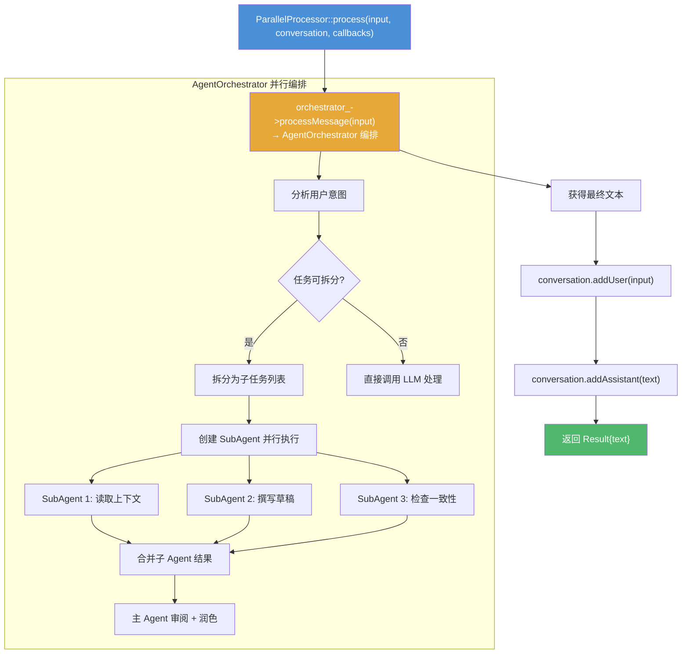

---

## 十二、工具自注册流程

展示从 `REGISTER_TOOL` 宏到运行时工具可用的完整链路。

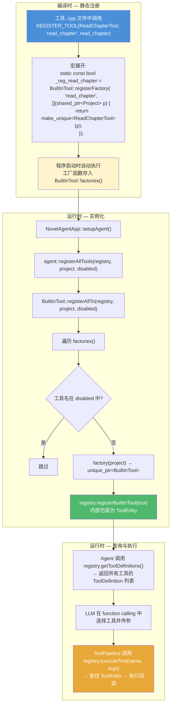

---

## 十三、关键设计模式汇总

| 模式 | 应用位置 | 说明 |
|------|----------|------|
| **策略模式** | `IMessageProcessor` → `SerialProcessor` / `ParallelProcessor` | Agent 的处理模式可插拔切换 |
| **门面模式** | `NovelAgentApp` | 封装全部组件装配 |
| **门面模式** | `ToolPipeline` | 统一工具执行管线（校验→执行→截断→错误处理） |
| **门面模式** | `StreamingPipeline` | 封装 SSEParser + StreamAccumulator |
| **模板方法** | `ToolCallLoop::run()` | 首轮调用→循环→执行→回传 的标准骨架 |
| **依赖倒置** | `ILLMClient` / `IOutputChannel` / `IStorageBackend` / `IProjectReader` | Agent 依赖抽象而非具体实现 |
| **工厂方法** | `Message::user()` / `Message::system()` 等 | 统一消息构造方式 |
| **自注册** | `REGISTER_TOOL` 宏 + `BuiltInTool::factories()` | 新增工具只需继承 + 宏调用 |
| **组合优于继承** | `ContextManager` 组合 4 个子模块 | 职责分离，各子模块可独立测试 |
| **RAII** | 所有资源管理 | 文件句柄、互斥锁、临时目录均通过类管理 |

---

## 十四、错误处理策略分布

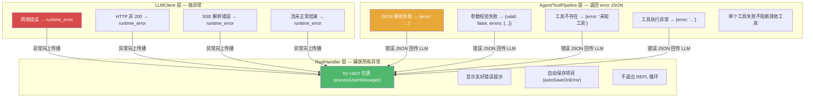

---

## 运行命令

在 VS Code 中打开此文件后，按 `Ctrl+Shift+V` 预览渲染效果；或安装 Mermaid 插件获得实时预览。

也可用命令行生成 SVG/PNG：

```bash
# 安装 mermaid-cli
npm install -g @mermaid-js/mermaid-cli

# 生成 SVG
mmdc -i docs/diagrams/Agent运行流程图.md -o docs/diagrams/Agent运行流程图.svg
```
