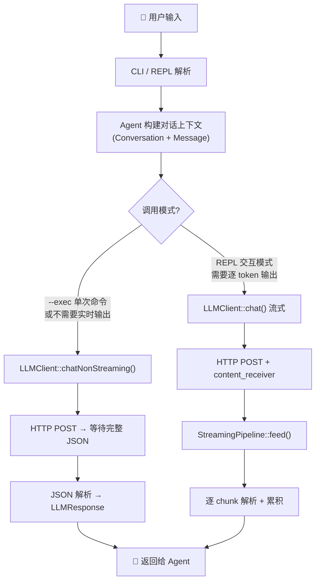
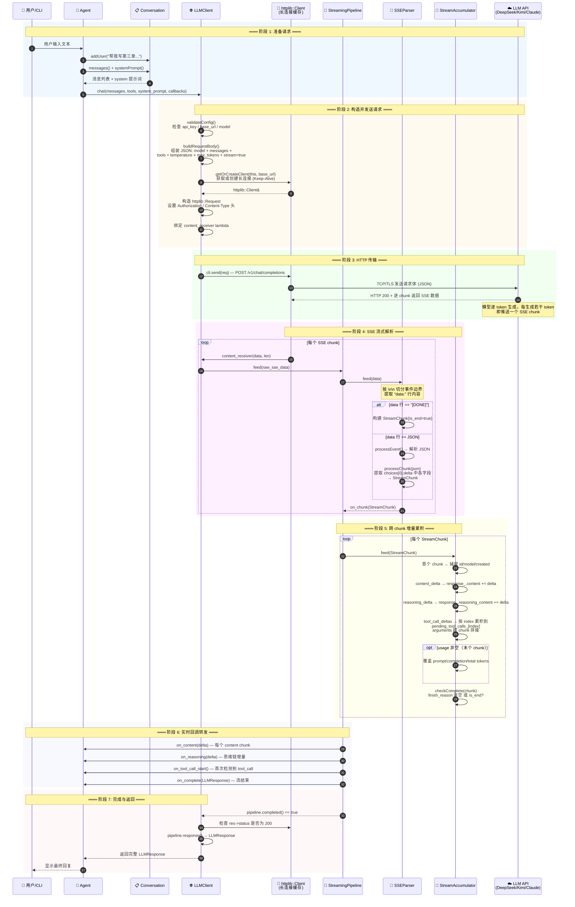
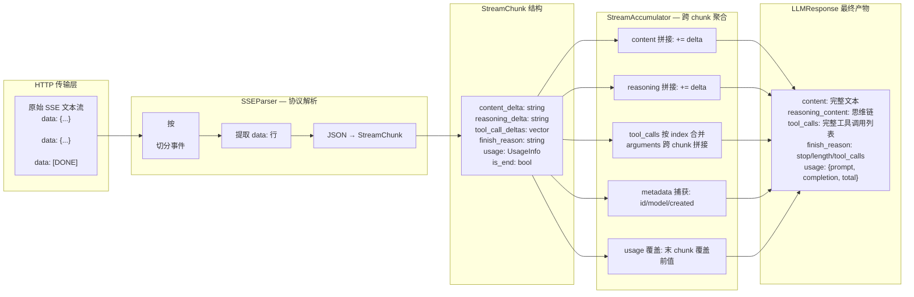
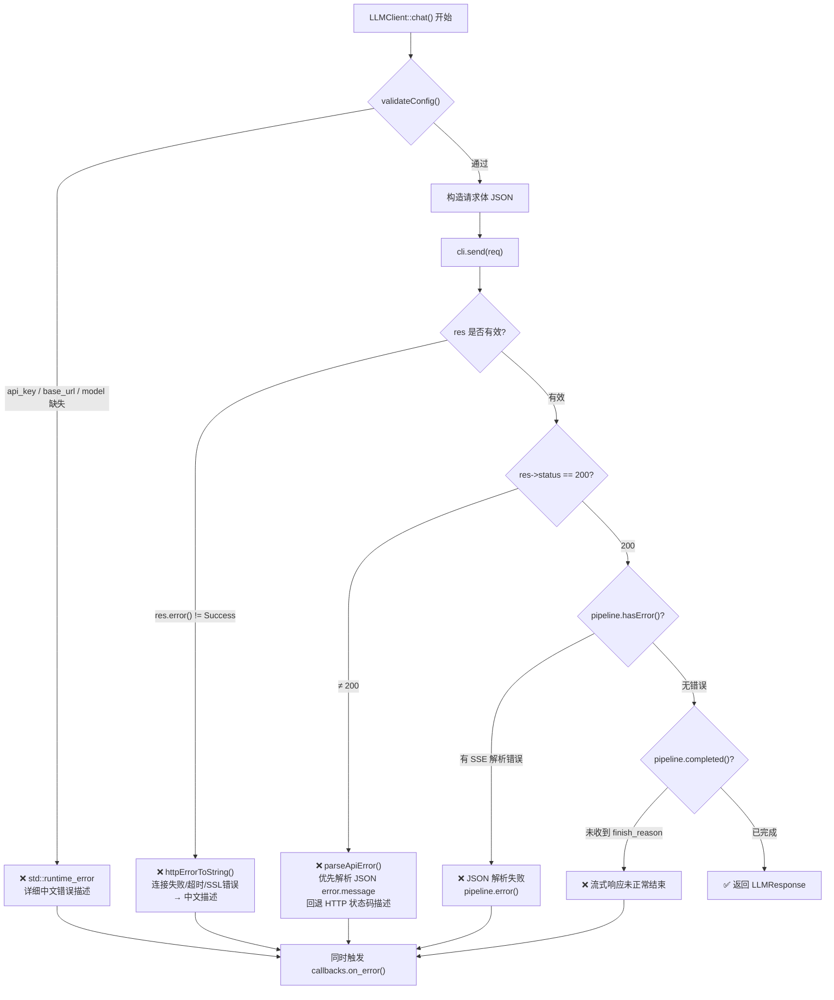

# NovelAgent — LLM 请求→响应 完整流程图

> 生成日期: 2026-06-08  
> 覆盖范围: 从用户输入到 LLMResponse 返回的完整数据流  
> 图表格式: Mermaid（可在 VS Code、GitHub、Typora 中直接渲染）

---

## 一、总览：非流式 vs 流式两条路径



---

## 二、详细时序图：流式调用完整过程



---

## 三、内部组件数据流图

展示各组件之间的数据类型转换：



---

## 四、错误处理路径



---

## 五、关键数据结构对照

| 阶段 | 数据类型 | 来源 | 去向 |
|------|----------|------|------|
| 请求构造 | `std::vector<Message>` | `Conversation::messages()` | `buildRequestBody()` → JSON |
| 请求体 | `nlohmann::json` (body) | `buildRequestBody()` | HTTP POST body |
| SSE 原始数据 | `std::string` (raw bytes) | `httplib::content_receiver` | `StreamingPipeline::feed()` |
| SSE 事件 | `std::string` (event text) | `SSEParser::feed()` 内部切分 | `SSEParser::processEvent()` |
| 解析单元 | `StreamChunk` | `SSEParser::processChunk()` | `StreamAccumulator::feed()` |
| 增量片段 | `ToolCallDelta` | `StreamChunk::tool_call_deltas` | `StreamAccumulator::pending_tool_calls_` |
| 最终产物 | `LLMResponse` | `StreamAccumulator::checkComplete()` | `LLMClient` → `Agent` |
| 回调通知 | `StreamCallbacks` 各字段 | `StreamingPipeline` 转发 | Agent / StreamDisplay |

---

## 六、非流式 vs 流式对比

| 特性 | `chatNonStreaming()` | `chat()` 流式 |
|------|---------------------|---------------|
| HTTP 方式 | `cli.Post()` — 等待完整响应 | `cli.send()` + `content_receiver` |
| 解析方式 | `nlohmann::json::parse(res.body)` 一次性 | SSEParser 逐 chunk 增量解析 |
| 用户体验 | 等待完成后一次性输出 | 逐 token 实时显示（打字机效果） |
| 超时配置 | ReadTimeout=180s | ReadTimeout=180s（模型慢时安全） |
| 适用场景 | `--exec` 单次命令、批量处理 | REPL 交互模式 |
| 连接复用 | ✅ 长连接缓存 (Keep-Alive) | ✅ 长连接缓存 (Keep-Alive) |
| 错误定位 | 一次 parse 失败即报错 | 可区分传输层/HTTP/SSE解析/流完整性 四层错误 |

---

## 七、运行命令

在 VS Code 中打开此文件后，按 `Ctrl+Shift+V` 预览渲染效果；或安装 Mermaid 插件获得实时预览。

也可用命令行生成 SVG/PNG：

```bash
# 安装 mermaid-cli
npm install -g @mermaid-js/mermaid-cli

# 生成 SVG
mmdc -i docs/diagrams/LLM请求响应流程图.md -o docs/diagrams/LLM请求响应流程图.svg
```
